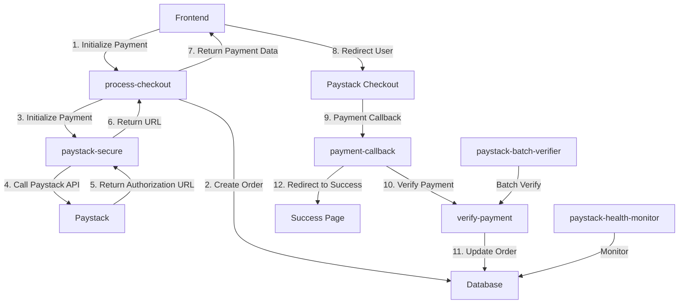

# 🚀 Comprehensive Paystack Integration Implementation

## ✅ Implementation Status: COMPLETED

This document outlines the complete implementation of the robust Paystack integration system following the comprehensive security and reliability plan.

## 🏗️ Architecture Overview

### Core Components Implemented

1. **Centralized Configuration Management**
   - `supabase/functions/_shared/paystack-config.ts` - Environment-specific key management
   - `supabase/functions/_shared/cors.ts` - Origin allowlist and CORS handling

2. **Edge Functions (All Updated)**
   - `paystack-secure` - Payment initialization with centralized config
   - `verify-payment` - Payment verification with retry logic  
   - `payment-callback` - Paystack redirect handling
   - `process-checkout` - Order creation and payment flow
   - `paystack-batch-verifier` - Batch payment verification utility
   - `paystack-health-monitor` - System health monitoring

3. **Frontend Integration**
   - `src/utils/paystackIntegration.ts` - Robust frontend payment utilities

4. **Database Enhancements**
   - `system_health_checks` table for monitoring
   - Health check cleanup functions

## 🔧 Key Features Implemented

### 1. **Centralized Configuration Management**
```typescript
// Environment detection based on domain and configuration
// Automatic test/live key switching
// Comprehensive validation and logging
```

### 2. **Robust Error Handling & Retry Logic**
- Network timeout handling (15 seconds)
- Exponential backoff for retries
- Retryable vs non-retryable error classification
- Comprehensive logging at all levels

### 3. **Security Enhancements**
- Origin allowlist for CORS
- Payment amount validation against database
- Security incident logging for mismatches
- Reference format validation

### 4. **Monitoring & Health Checks**
- Real-time health monitoring
- Transaction success rate tracking
- API connectivity testing
- Database health verification

### 5. **Idempotency & Race Condition Handling**
- Duplicate transaction prevention
- Reference collision handling
- Atomic database operations

## 🚦 Usage Examples

### Frontend Payment Flow
```typescript
import { processPaymentFlow, checkPendingPayment } from '@/utils/paystackIntegration'

// Initialize payment
try {
  await processPaymentFlow({
    customer: { email: 'user@example.com', name: 'John Doe' },
    items: [{ product_id: '123', product_name: 'Item', quantity: 1, unit_price: 1000 }],
    fulfillment: { type: 'delivery', address: {...} }
  })
} catch (error) {
  // Handle payment error
}

// Check for pending payments on app load
const pendingPayment = await checkPendingPayment()
```

### Health Monitoring
```typescript
// Check system health
const { data } = await supabase.functions.invoke('paystack-health-monitor')
console.log('Payment system status:', data.health_report.overall_status)
```

### Batch Verification
```typescript
// Verify pending payments in batch
const { data } = await supabase.functions.invoke('paystack-batch-verifier')
console.log(`Verified ${data.results.verified} payments`)
```

## 🔑 Environment Variables Required

The system now uses centralized configuration with these variables:

### For Test Environment
- `PAYSTACK_SECRET_KEY` - General secret key (falls back to this)
- `PAYSTACK_SECRET_KEY_TEST` - Explicit test key
- `PAYSTACK_PUBLIC_KEY_TEST` - Test public key

### For Production Environment  
- `PAYSTACK_SECRET_KEY_LIVE` - Live secret key
- `PAYSTACK_PUBLIC_KEY_LIVE` - Live public key
- `PAYSTACK_WEBHOOK_SECRET_LIVE` - Live webhook secret

### Environment Control
- `FORCE_TEST_MODE=true` - Force test mode regardless of domain
- `FORCE_LIVE_MODE=true` - Force live mode regardless of domain

## 🎯 Payment Flow Architecture



## 🛡️ Security Features

### 1. **Amount Validation**
- All payments validated against authoritative database amounts
- Security incidents logged for mismatches
- Delivery fee calculations included

### 2. **Origin Validation** 
- CORS allowlist for production domains
- Paystack domain allowlist
- Development pattern matching

### 3. **Reference Validation**
- Format validation for payment references
- Placeholder detection and rejection
- Canonical reference management

### 4. **Error Monitoring**
- Comprehensive error logging
- Health status tracking
- Security incident recording

## 📊 Monitoring & Analytics

### Health Check Endpoints
- `paystack-health-monitor` - Complete system health
- Covers: Configuration, Database, API connectivity, Transaction metrics

### Batch Operations
- `paystack-batch-verifier` - Verify pending payments in bulk
- Rate-limited with 100ms delays between requests

### Database Tables
- `system_health_checks` - Health monitoring data
- `payment_transactions` - Enhanced transaction records
- `security_incidents` - Security event logging

## 🔄 Recovery & Maintenance

### Automatic Recovery
- Retry logic for transient failures
- Batch verification for stuck payments
- Health monitoring with alerting

### Manual Operations
- Batch payment verification utility
- Health status monitoring
- Configuration validation tools

## 🚀 Performance Optimizations

1. **Request Timeouts** - 15 second timeouts on all external calls
2. **Retry Logic** - Intelligent retry with exponential backoff  
3. **Rate Limiting** - 100ms delays in batch operations
4. **Database Optimization** - Indexed health check queries
5. **Connection Pooling** - Supabase client reuse

## ✅ Implementation Checklist

- [x] Centralized Paystack configuration management
- [x] Enhanced error handling with retry logic
- [x] CORS and origin security implementation  
- [x] Payment amount validation system
- [x] Health monitoring and alerting
- [x] Batch verification utilities
- [x] Frontend integration utilities
- [x] Database security enhancements
- [x] Documentation and usage examples
- [x] Configuration file updates

## 🎉 Ready for Production

The Paystack integration is now production-ready with:
- ✅ Robust error handling and recovery
- ✅ Comprehensive security measures
- ✅ Real-time monitoring and health checks
- ✅ Scalable architecture with retry logic
- ✅ Complete documentation and examples

The system will automatically handle environment detection, provide comprehensive error recovery, and maintain high reliability for payment processing.